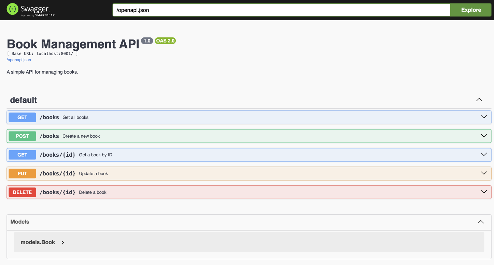
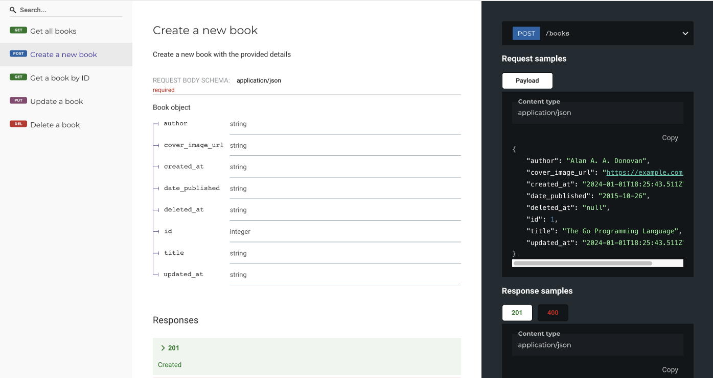

# swift-api-rest-go

This project implements a simple API just to illustrate how one would go about implementing a REST API using [Gin](https://gin-gonic.com) and [Go](https://go.dev). 

## Setup

* [Setup for macOS](./docs/setup-macos.md)

## Run

```bash
source configure.sh

# debug
go run main.go

# release
export GIN_MODE=release
go run main.go

# use database file instead of in-memory databse
export DATABASE_URL="books.db" 
go run main.go
```

Browse the docs and test the API via the Swagger UI:

```bash
open http://localhost:8001/docs
```



Browse the docs using Redoc. This is an alternative to the Swagger UI:

```bash
open http://localhost:8001/redoc
```



## Updating the code

```bash
source configure.sh
```

Open the project directory in Visual Studio Code:

```bash
code .
```

If you update the API metadata, make sure you run `./swag-init.sh`  to update the `swag` module:

```bash
# runs `swag init --output ./swag` 
./swag-init.sh
```

## Development

Run the tests (from the command line):

```sh
./test.sh

# or
GIN_MODE=release go test
```

Generate test coverage report:

```bash
./coverage.sh

# or
GIN_MODE=release go test -coverprofile=coverage.out
go tool cover -func=coverage.out
go tool cover -html=coverage.out -o coverage.html

# to see the HTML report
open coverage.html
```

## Run in Podman / Docker 

> In order to do this you will need Podman. See [Setup Podman on macOS](./docs/setup-podman-macos.md) for details.

Rebuild container image and start container:

```bash
./scripts/podman.sh
```

Delete container and image:

```bash
./scripts/podman-delete.sh
```

## How to create a new project

```bash
# create module
go mod init swift-api-rest-go

# add packages
go get -u github.com/gin-gonic/gin
go get -u gorm.io/gorm
go get -u gorm.io/driver/sqlite

# Swagger and Redoc UI 
go get -u github.com/go-openapi/runtime/middleware

# testing / asserts / mocking
go get github.com/stretchr/testify

# tools
go install -a golang.org/x/tools/cmd/godoc@latest 
go install -a github.com/swaggo/swag/cmd/swag@latest 
go install -a github.com/mitranim/gow@latest 

# generate swagger docs
swag init --output ./swag
```

